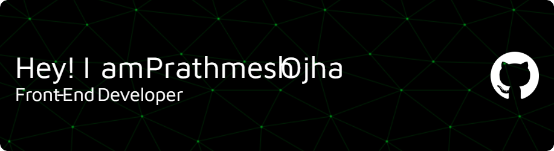

    

    <h2 align="center">B.Tech CSE Student | Passionate about Technology and Innovation | India</h2>
    <!-- 

        
    
 -->
    <!--  -->
    <!-- 

        
        
    
 -->

<ul>
    <li>🔭 I’m currently working on 
        <a href="https://github.com/ojhaprathmesh/AngelFive_Repo">
            <em>
                Angel Five
            </em>
        </a>
    </li>
    <li>🌱 I’m currently learning 
        <strong>
            <em>
                Next.js and Django
            </em>
        </strong>
    </li>
    <li>🤝 I’m looking for help with 
        <a href="https://github.com/ojhaprathmesh/Beat.it_Repo">
            <em>
                Beat.It: Full Stack Music Player
            </em>
        </a>
    </li>
    <li>💬 Ask me about <strong><em>Python</em></strong></li>
    <li>📄 Know about my experiences: 
        <a href="https://github.com/ojhaprathmesh/ojhaprathmesh/blob/main/docs/Updated_Resume.pdf">
            <em>
                Resume.pdf
            </em>
        </a>
    </li>
</ul>

###

<h4 align="left">Known Technologies</h4>

###

 

    
    
    
    
    
    
    
    
    
    
    
    
    
    
    
    
    
    
    
    
    
    
    
    
    
    
    
    
    
    
    
    
    
    
    

###

<h4 align="left">Social Media</h4>

###

    

###
