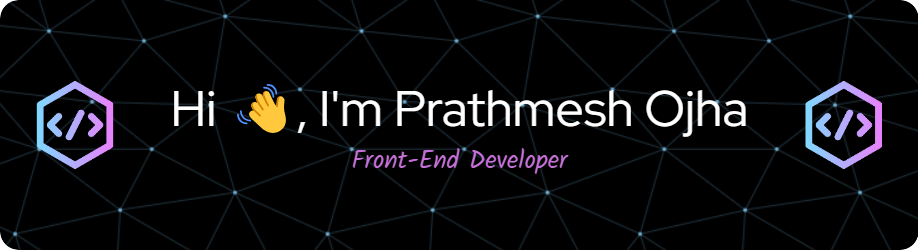

    

    <h2 align="center">B.Tech CSE Student | Passionate about Technology and Innovation | India</h2>
    

        
    

    
    

        
        
    

<ul>
    <li>🔭 I’m currently working on <a href="https://github.com/ojhaprathmesh/Beat.it"><em>Beat.it</em></a></li>
    <li>🌱 I’m currently learning <strong><em>React.js, Express.js and Node.js</em></strong></li>
    <li>🤝 I’m looking for help with <a href="https://github.com/ojhaprathmesh/ASADWI_Repo"><em>ASADWI: AI-based Spatial
            Analysis for Drinking Water Information</em></a></li>
    <li>💬 Ask me about <strong><em>Python</em></strong></li>
    <li>📄 Know about my experiences: <a
            href="https://github.com/ojhaprathmesh/ojhaprathmesh/blob/main/docs/Resume-Canva.pdf"><em>Resume.pdf</em></a></li>
</ul>

<h3 align="left">Languages and Tools:</h3>

                   

<table>
    <caption>
        <h3>Current Stats:</h3>
    </caption>
    <tr>
        <td rowspan="2">
            
        </td>
        <td>
            
        </td>
    </tr>
    <tr>
        <td>
            
        </td>
    </tr>
</table>

<h3 align="left">Connect with me:</h3>

    
    <a href="https://linkedin.com/in/ojhaprathmesh" target="blank">
        
    
    
    

